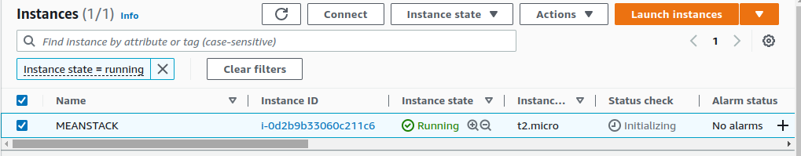

# MEAN STACK IMPLEMENTATION

This project aims to create familiarization with MEAN stack and deploy it to Ubuntu server.

### MEAN STACK CONSTITUENTS
* MONGODB - A document based database to store and retrieve data
* Express - A Back-end application framework for making request to database, read and wrife functions. It is a minimal and flexible Node.js web application framework that provides features for web and mobile applications.
* Angular - Handles Client and Server Requests. AngularJS provides a web framework for creating dynamic views in web applications. In this project, AngularJS is used to connect our webpage with Express and perform actions on the book register. 
* Node.js - Accepts and displays results to end-user. Used to setup Express routes and Angular controllers.

## STEP 0 - PREPARING PREREQUISITES
I created a virtual server with Ubuntu OS on my AWS account as shown in the snapshots below:




## STEP 1 - INSTALLING NodeJS
Firstly, I rand the update and upgrade command:
```bash
    sudo apt update && sudo apt upgrade
```


Afterwards I added the certificates.


*While adding the certificates I saw that node.js 12.X was no longer supported, so I got the certificate for the recommended node.js 14.x version.*


Then, I installed node.js 


## STEP 2: INSTALLING MONGODB
The application to be installed would conssit of fields such as book name, isbn number, author, number of pages.

I imported the release sign in key to authenticate the version to be installed and downloaded the MONGODB app.


I installed the mongodb app.


I started the server and confirmed it was active.


I tried installing npm - Node package manager but it showed an error message:


I checked if npm already exists and it has already been installed along with node.js


While attempting to run
```bash
    sudo npm install body-parser
```
I encountered an error:


In running troubleshoot, I ran the command 
```bash
    npm init -y
```


I tried reinstalling body-parser


I created accessed the Books directory and initialized the npm project.


I created the server.js file and inputted the necessary code.


## INSTALLING EXPRESS AND SETTING UP ROUTES TO THE SERVER
I installed the express mongoose app


I created apps directory and accessed the directory.

```bash
    mkdir apps && cd apps
```
I created a routes.js file in the books/apps directory and wrote the required code


I created book.js file in the books/apps/models directory and worte the necessary code.


## STEP 4- ACCESS THE ROUTES WITH AngularJS

Create a public directory under the books directory and add a file named script.js and inputted the required code.


Index.html is also created and added in the public directory.


